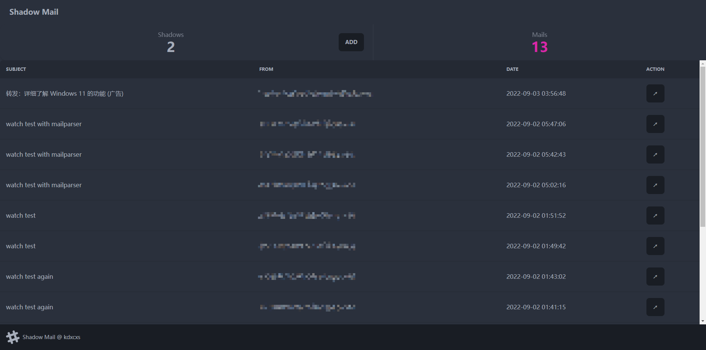
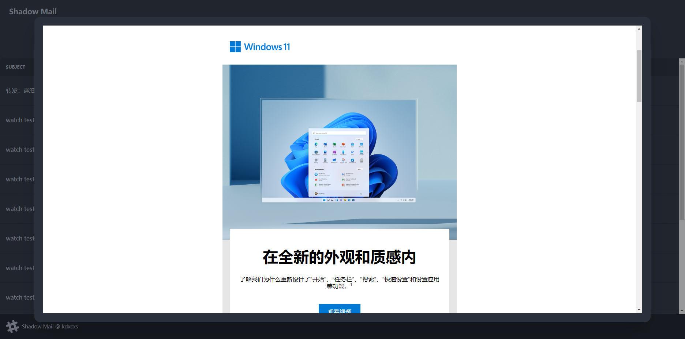

# Shadow Mail

One email address for only one account.

Alomost every website or app requires an email for their account, this, however, may help others to track you.
Shadow Mail helps you to create an email addres for only one website or app account to receive emails.

Currently, Shadow Mail is only for single user scenario, which means it's designed for someone who knows how to construct an email server, act as a intranet service for personnal use.

## Screenshot





## Deploy

```bash
MAILDIR=/var/mail/ POSTFIX_ACCOUNTS=/etc/postfix-accounts.cf flask run
```
